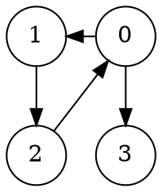
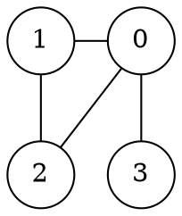

# GConv

Simple tool to convert files containing graph data between different notations

# File Format

Example of expected input (and produced output) for the following directed graph.




## *-v*

First line contains the number of verteces *n<sub>V</sub>* (labelled 0 - *n<sub>V</sub>*-1).  
Verteces with no outgoing edge **MUST** be included.

```
4
0: 1 3 #
1: 2 #
2: 0 #
3: #
```

## *-e*

```
0	1
0	3
1	2
2	0
```

## *-bv*

64-bit signed int little eendian encoding of graph.

**HEADER** (16 bytes):
- *n<sub>V</sub>* (64 MSB)
- *n<sub>Emax</sub>* (64 LSB)

**BODY** (8 * (*n<sub>Emax</sub>* + 1) bytes) repeated *n<sub>V</sub>* times:
- vertex laber *v<sub>i</sub>* (64 MSB)
- *n<sub>Emax</sub>* adjecent verteces *w<sub>i</sub>* (64 * *n<sub>Emax</sub>* LSB)
  - if *v<sub>i</sub>* has *n<sub>E</sub> < n<sub>Emax</sub>* adjacent vertices, the remaining *p = 8 * (n<sub>Emax</sub> - n<sub>E</sub>)* bytes are padded with `0xFF`


```
        00 01 02 03 04 05 06 07

0x00	04 00 00 00 00 00 00 00
0x08	02 00 00 00 00 00 00 00
0x10	00 00 00 00 00 00 00 00
0x18	01 00 00 00 00 00 00 00
0x20	03 00 00 00 00 00 00 00
0x28	01 00 00 00 00 00 00 00
0x30	02 00 00 00 00 00 00 00
0x38	FF FF FF FF FF FF FF FF
0x40	02 00 00 00 00 00 00 00
0x48	00 00 00 00 00 00 00 00
0x50	FF FF FF FF FF FF FF FF
0x58	03 00 00 00 00 00 00 00
0x60	FF FF FF FF FF FF FF FF
0x68	FF FF FF FF FF FF FF FF
```

---

Example of produced output (with option *-u*) for the following undirected graph.




## *-v*

First line contains the number of verteces `nV` (labelled `0` - `nV-1`).

```
4
0: 1 2 3 #
1: 0 2 #
2: 0 1 #
3: 0 #
```

## *-e*

```
0	1
0	2
0	3
1	0
1	2
2	0
2	1
3	0
```

## *-bv*

64-bit signed int little eendian encoding of graph.

**HEADER** (16 bytes):
- *n<sub>V</sub>* (64 MSB)
- *n<sub>Emax</sub>* (64 LSB)

**BODY** (8 * (*n<sub>Emax</sub>* + 1) bytes) repeated *n<sub>V</sub>* times:
- vertex laber *v<sub>i</sub>* (64 MSB)
- *n<sub>Emax</sub>* adjecent verteces *w<sub>i</sub>* (64 * *n<sub>Emax</sub>* LSB)
  - if *v<sub>i</sub>* has *n<sub>E</sub> < n<sub>Emax</sub>* adjacent vertices, the remaining *p = 8 * (n<sub>Emax</sub> - n<sub>E</sub>)* bytes are padded with `0xFF`


```
        00 01 02 03 04 05 06 07

0x00	04 00 00 00 00 00 00 00
0x08	03 00 00 00 00 00 00 00
0x10	00 00 00 00 00 00 00 00
0x18	01 00 00 00 00 00 00 00
0x20	02 00 00 00 00 00 00 00
0x28	03 00 00 00 00 00 00 00
0x30	01 00 00 00 00 00 00 00
0x38	00 00 00 00 00 00 00 00
0x40	02 00 00 00 00 00 00 00
0x48	FF FF FF FF FF FF FF FF
0x50	02 00 00 00 00 00 00 00
0x58	00 00 00 00 00 00 00 00
0x60	01 00 00 00 00 00 00 00
0x68	FF FF FF FF FF FF FF FF
0x70	03 00 00 00 00 00 00 00
0x78	00 00 00 00 00 00 00 00
0x80	FF FF FF FF FF FF FF FF
0x88	FF FF FF FF FF FF FF FF
```