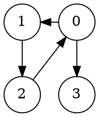
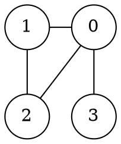

# GConv

Simple tool to convert files containing graph data between different notations

# File Format

Example of expected input (and produced output) for the following directed graph.




## *-v*

First line contains the number of verteces `nV` (labelled `0` - `nV-1`).  
Verteces with no outgoing edge **MUST** be included.

```
4
0: 1 3 #
1: 2 #
2: 0 #
3: #
```

## *-e*

```
0	1
0	3
1	2
2	0
```

---

Example of produced output (with option *-u*) for the following undirected graph.




## *-v*

First line contains the number of verteces `nV` (labelled `0` - `nV-1`).

```
4
0: 1 2 3 #
1: 0 2 #
2: 0 1 #
3: 0 #
```

## *-e*

```
0	1
0	2
0	3
1	0
1	2
2	0
2	1
3	0
```
